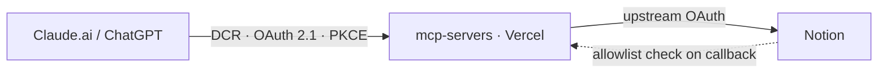

# mcp-servers

> Kincaid's custom MCP servers

## Notion

The official Notion MCP gates its database query tools behind Business plans. This MCP server reimplements them, running alongside the official MCP (which exposes CRUD and search).

| Tool                         | Description                                                 |
| :--------------------------- | :---------------------------------------------------------- |
| `notion-query-data-source`   | Query a database with a filter, sorts, and pagination       |
| `notion-query-database-view` | Query a saved view, applying its configured filter and sort |

#### Setup

1. **[Create a Notion integration](https://www.notion.so/profile/integrations).** Enable capabilities **Read content** and **User information including email addresses**. Add redirect URI `<PUBLIC_BASE_URL>/notion/oauth/notion-callback`. Then on the deployment, set:

   | Environment variable           | Value                                              |
   | :----------------------------- | :------------------------------------------------- |
   | `NOTION_OAUTH_CLIENT_ID`       | From the integration                               |
   | `NOTION_OAUTH_CLIENT_SECRET`   | From the integration                               |
   | `ALLOWED_NOTION_EMAILS`        | Comma-separated workspace-owner emails (preferred) |
   | `ALLOWED_NOTION_WORKSPACE_IDS` | Comma-separated workspace UUIDs (fallback)         |

2. **Connect the MCP.** Add `<PUBLIC_BASE_URL>/notion` to the agent, e.g. Claude.ai. Walk through OAuth, pick an account, and connect.

## Architecture



Each service's endpoint is its own OAuth authorization server (shared code in [`lib/oauth-as/`](./lib/oauth-as/)): it issues the tokens clients use and brokers the upstream provider's OAuth underneath.

It holds no state: auth codes and access/refresh tokens are self-contained [`jose`](https://github.com/panva/jose) JWTs, so the server needs no database or key-value store. To revoke all issued tokens, rotate `JWT_SIGNING_KEY`.

## Deployment

Deploy the Next.js app (e.g. on Vercel), configuring these environment variables:

| Environment variable | Value                                      |
| :------------------- | :----------------------------------------- |
| `PUBLIC_BASE_URL`    | Deployment apex, no path or trailing slash |
| `JWT_SIGNING_KEY`    | `openssl rand -base64 32`                  |

## Local development

```bash
pnpm install
cp .env.example .env   # fill in
pnpm dev               # localhost:3000/notion
```

`pnpm test` (vitest), `typecheck`, `lint` (oxlint), `format` (oxfmt), `build`

Drive OAuth locally with `@modelcontextprotocol/inspector`. Notion needs an HTTPS redirect URI, so use ngrok or a preview deploy for the full handshake.

## Note on OAuth phishing

Dynamic client registration lets anyone register a `client_id` for any `redirect_uri`. An attacker may trick users into opening an authorization link and approving, gaining access to the upstream provider.

To blunt this, we render an interstitial consent screen that prominently displays the _registrable domain_ (eTLD+1) of the site requesting access, so `claude.ai.evil.com` shows as `evil.com` rather than `claude.ai`. It also rejects internationalized domains outright, failing closed on homographs like `clаude.ai` (which could be confused with the legitimate `claude.ai`).
