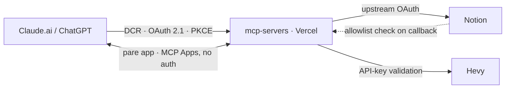

# mcp-servers

> Kincaid's custom MCP servers

## Notion

The official Notion MCP gates its database query tools behind Business plans. This MCP server reimplements them, running alongside the official MCP (which exposes CRUD and search).

| Tool                         | Description                                                 |
| :--------------------------- | :---------------------------------------------------------- |
| `notion-query-data-source`   | Query a database with a filter, sorts, and pagination       |
| `notion-query-database-view` | Query a saved view, applying its configured filter and sort |

#### Setup

1. **[Create a Notion integration](https://www.notion.so/profile/integrations).** Enable capabilities **Read content** and **User information including email addresses**. Add redirect URI `<PUBLIC_BASE_URL>/notion/oauth/notion-callback`. Then on the deployment, set:

   | Environment variable           | Value                                              |
   | :----------------------------- | :------------------------------------------------- |
   | `NOTION_OAUTH_CLIENT_ID`       | From the integration                               |
   | `NOTION_OAUTH_CLIENT_SECRET`   | From the integration                               |
   | `ALLOWED_NOTION_EMAILS`        | Comma-separated workspace-owner emails (preferred) |
   | `ALLOWED_NOTION_WORKSPACE_IDS` | Comma-separated workspace UUIDs (fallback)         |

2. **Connect the MCP.** Add `<PUBLIC_BASE_URL>/notion` to the agent, e.g. Claude.ai. Walk through OAuth, pick an account, and connect.

## Hevy

Read and log [Hevy](https://hevy.com) workouts, build routines, and track body measurements from an agent.

| Tool                           | Description                                             |
| :----------------------------- | :------------------------------------------------------ |
| `hevy-list-workouts`           | List workouts, or filter by date range across pages     |
| `hevy-get-workout`             | Fetch one workout by id                                 |
| `hevy-get-workout-count`       | Total workout count                                     |
| `hevy-get-exercise-history`    | Every logged set of one exercise, for progress analysis |
| `hevy-save-workout`            | Log a workout, or update one (full replace)             |
| `hevy-list-routines`           | List routines                                           |
| `hevy-get-routine`             | Fetch one routine by id                                 |
| `hevy-save-routine`            | Create a routine, or update one (full replace)          |
| `hevy-list-exercise-templates` | List exercises with muscle groups and equipment         |
| `hevy-get-exercise-template`   | Fetch one exercise template by id                       |
| `hevy-list-routine-folders`    | List routine folders, or fetch one by id                |
| `hevy-create-routine-folder`   | Create a routine folder                                 |
| `hevy-list-body-measurements`  | List body weight and circumference measurements         |
| `hevy-log-body-measurement`    | Log a body measurement for a date                       |

The Hevy API has no deletes, so neither does this server.

Hevy stores metric, and this server converts on both edges so the model never does the arithmetic. Sets and body weight accept `weight_lbs` alongside `weight_kg`, converted server-side with the exact factor; pass one or the other, never both. Distance stays in `distance_meters` and duration in `duration_seconds`, both metric on the way in and out. Reads render in whatever `display.units` is set to in `config.ts`.

Do not convert pounds in the caller. A tidy kilogram value is not a tidy pound value, so 75 lb rounded to 34 kg shows up in Hevy as 74.96 lb.

#### Setup

Hevy has no OAuth; its API uses a static per-user key ([Hevy Pro](https://hevy.com/settings?developer) required). The bridge still fronts the MCP endpoint with OAuth: the consent screen collects your API key, validates it against `GET /v1/user/info`, and seals it inside the encrypted tokens it issues. The key is never stored server-side. To revoke, rotate `JWT_SIGNING_KEY` or regenerate the key in Hevy.

1. **Set the allowlist.** On the deployment, set `ALLOWED_HEVY_USER_IDS` to comma-separated Hevy user ids (the `data.id` from `curl -H "api-key: $KEY" https://api.hevyapp.com/v1/user/info`).

2. **Connect the MCP.** Add `<PUBLIC_BASE_URL>/hevy` to the agent. On the consent screen, paste your API key from [Hevy settings → Developer](https://hevy.com/settings?developer).

## Pare

Card-stack triage for the decisions an agent should not make alone: which newsletters to unsubscribe from, which tasks to drop, which files to archive. The agent opens a session with the items, the user works through them one card at a time in an [MCP App](https://github.com/modelcontextprotocol/ext-apps) inside the chat, and the decisions come back as a message with item ids and notes.

| Tool         | Description                                                                                 |
| :----------- | :------------------------------------------------------------------------------------------ |
| `pare-start` | Open a session in the app from a list of items and per-session action labels, or reopen one |

Every session has two primary actions with fixed ids, `keep` (right) and `dispose` (left), whose labels the agent sets per task ("Stay subscribed" / "Unsubscribe"), plus up to four extra actions for a third bucket (Snooze, Delegate). Each card carries a title, a subtitle for the source, a plain-text body, label/value facts, tags, a link, and the agent's suggestion with a reason.

In the app: `→` keeps, `←` disposes, `Enter` takes the card's suggestion (or keeps), `1` to `4` pick extra actions, `↓` moves the card to the bottom of the deck, `⌘Z` undoes. Cards never expand: a body is at most four lines, so a hard case gets a note or a deferral rather than more reading. Typing any letter opens a note for the card; inside it `Enter` still decides, `⌘←` / `⌘→` decide by direction, and `Escape` returns to the deck with the note kept. Cards also drag with the mouse and swipe with two fingers on a trackpad.

The server holds nothing. After every decision the app updates the model's context with the whole list so far (quietly, without triggering a reply) and caches the session in browser storage, so a re-render of the conversation picks up where the user stopped. The summary screen sends the full list to the chat as a message. To continue in a later conversation, the agent calls `pare-start` again with the same items, the `session_id`, and the decisions from its context.

#### Setup

Add `<PUBLIC_BASE_URL>/pare` to the agent. No credentials, no environment variables. Claude.ai, Claude Desktop, and ChatGPT render MCP Apps.

#### Developing the UI

The app is a React single-file build under [`app/pare/_internal/ui/`](./app/pare/_internal/ui/), served by the MCP server as the resource `ui://pare/app.html`.

```bash
pnpm ui:dev     # harness at localhost:5173/harness.html: a stand-in host with fixtures, theme toggle, and what the model would see
pnpm ui:build   # writes app/pare/_internal/ui/dist/index.html (pnpm build runs this first)
pnpm test:e2e   # Playwright against the harness, using the built file the way a real host does
pnpm smoke:pare # the tool and the resource over HTTP against a running server
```

## Architecture


```mermaid
flowchart LR
    client["Claude.ai / ChatGPT"]
    bridge["mcp-servers · Vercel"]
    notion["Notion"]
    hevy["Hevy"]

    client -->|"DCR · OAuth 2.1 · PKCE"| bridge
    client <-->|"pare app · MCP Apps, no auth"| bridge
    bridge -->|"upstream OAuth"| notion
    notion -.->|"allowlist check on callback"| bridge
    bridge -->|"API-key validation"| hevy
```

Each credentialed service's endpoint is its own OAuth authorization server (shared code in [`lib/oauth-as/`](./lib/oauth-as/)): it issues the tokens clients use and handles the upstream credential underneath. For providers with OAuth (Notion), it brokers the upstream flow; for API-key providers (Hevy), the consent screen collects and validates the key instead. Pare touches no upstream and no user data, so it has no auth.

It holds no state: auth codes and access/refresh tokens are self-contained [`jose`](https://github.com/panva/jose) JWTs, so the server needs no database or key-value store. To revoke all issued tokens, rotate `JWT_SIGNING_KEY`.

## Deployment

Deploy the Next.js app (e.g. on Vercel), configuring these environment variables:

| Environment variable | Value                                      |
| :------------------- | :----------------------------------------- |
| `PUBLIC_BASE_URL`    | Deployment apex, no path or trailing slash |
| `JWT_SIGNING_KEY`    | `openssl rand -base64 32`                  |

## Local development

```bash
pnpm install
cp .env.example .env   # fill in
pnpm dev               # localhost:3000/notion
```

`pnpm test` (vitest), `test:e2e` (Playwright, pare UI), `typecheck`, `lint` (oxlint), `format` (oxfmt), `build`

Drive OAuth locally with `@modelcontextprotocol/inspector`. Notion needs an HTTPS redirect URI, so use ngrok or a preview deploy for the full handshake. Hevy has no upstream redirect, so its full flow works on plain localhost.

## Note on OAuth phishing

Dynamic client registration lets anyone register a `client_id` for any `redirect_uri`. An attacker may trick users into opening an authorization link and approving, gaining access to the upstream provider.

To blunt this, we render an interstitial consent screen that prominently displays the _registrable domain_ (eTLD+1) of the site requesting access, so `claude.ai.evil.com` shows as `evil.com` rather than `claude.ai`. It also rejects internationalized domains outright, failing closed on homographs like `clаude.ai` (which could be confused with the legitimate `claude.ai`).
